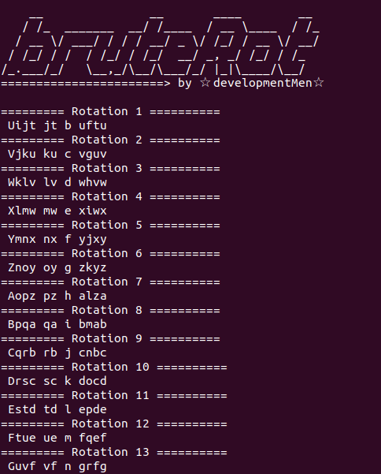
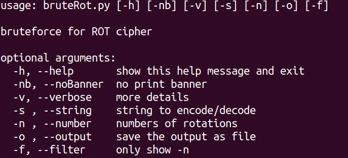

# bruteRot
brute force to caesar cipher/Rot cipher

## Como se usa
	python3 bruteRot.py -s "Esto es una prueba/This is a test"

## To-Do
- GUI
	- Another alphabets
	- web 
	- detect lenguajes
	- maybe a translate options

### help

