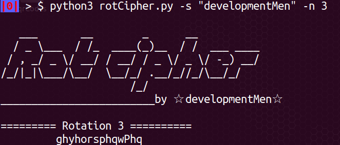
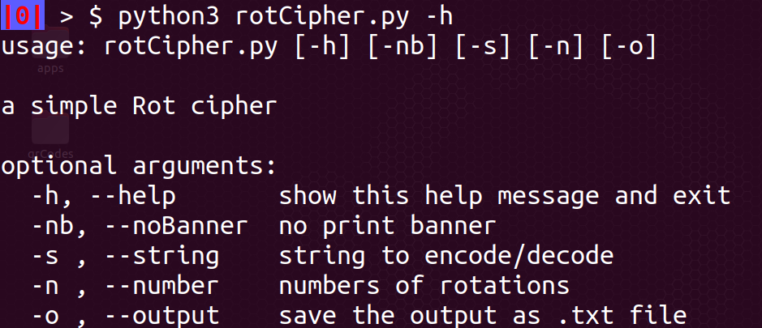

# Rot cipher
caesar cipher/Rot cipher

## Como se usa
	python3 rotCipher.py -s "developmentMen" -n 3

## To-Do
	- GUI Scrollbar
- Another alphabets
	- web 
	- detect lenguajes
	- maybe a translate lenguajes options

### help

